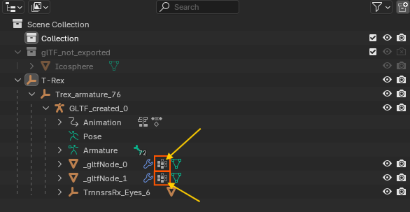

# Asset Compatibility and Workarounds

## Overview

This document covers assets that work well with the glTF/GLB Importer for Maya and provides practical solutions for common import challenges.

---

## What Works Well

- **Standard glTF 2.0 Compliant Files**: Assets that follow the [Khronos glTF 2.0 specifications](https://www.khronos.org/gltf/) import reliably
- **Geometry and Materials**: Meshes, PBR materials, and textures import correctly
- **Animations**: Transform animations, skeletal (rigged) animations, and blendshape animations are fully supported
- **Standard Exporters**: Files from widely-used glTF exporters (Blender, Maya/Babylon, etc.) are well-supported

---

## Recommended Workarounds

### For Sketchfab Assets with Rigged Animations

If you experience deformation accuracy issues with auto-generated Sketchfab assets:

1. **Enable Use Exact Inverse Bind Matrices**: In the import options under **Geometry Options**, enable **Use Exact Inverse Bind Matrices** (only available when **Import Skin Binding** is enabled)
2. **Import the Asset**: This option uses the exact inverse bind matrices from the glTF/GLB file, providing more accurate skeletal deformation that matches the original file's joint transformations
3. **If Issues Persist**: Disable the option to let Maya recalculate bind matrices automatically

> **Note**: Most users should leave this option disabled unless importing auto-generated assets with deformation accuracy issues from platforms like Sketchfab that may have non-standard bind pose configurations.

#### Alternative Blender Preprocessing Workflow

If the above doesn't resolve the issue, use this Blender preprocessing workflow:

1. **Import into Blender**: Import the original Sketchfab glTF/GLB file into Blender
2. **Select Rigged Meshes**: In the Outliner, select all meshes that have skin weights applied (identify these by looking for Vertex Groups in the mesh properties)

3. **Clear Parent Relationship**: Press `Alt + P` and choose **"Clear and Keep Transformation"**
4. **Re-export**: Export the file in glTF/GLB format from Blender
5. **Import into Maya**: The processed file should now import correctly into Maya

### Alternative Sketchfab Workarounds:

- **Manual Orientation Correction**: Manually adjust object transforms after import

- **Re-rigging**: Consider re-rigging complex characters in Maya after import

- **Animation Recreation**: For critical animations, recreate keyframes manually in Maya

### General Best Practices

- **Test Import**: Always test import with a simple version of your asset first

- **Backup Projects**: Maintain backups of your Maya scenes before importing complex assets

- **File Validation**: Use glTF validators to check file integrity before import

- **Alternative Sources**: When possible, obtain assets from sources that use standard glTF exporters

- **Asset Preparation**: For complex assets, consider simplifying or optimizing them before import

---

## Round-trip Workflow: Re-exporting Imported Assets

When importing glTF/GLB files and then wanting to export them again using the Babylon exporter, several compatibility issues arise:

### Known Export Issues

**Material Compatibility Problems:**

1. **Shader Type Conflicts**: If you selected Standard Surface, Arnold, or OpenPBR when importing files, the Babylon exporter won't process these materials properly
   - The importer uses aiImage nodes and intermediate conversion nodes
   - Babylon only accepts normal file nodes without intermediate conversion nodes

2. **Limited Material Support**: Babylon doesn't support additional material properties except Clear Coat when using Standard and Arnold shaders. Stingray shader doesn't support glTF extensions. Babylon doesn't have support for OpenPBR

3. **Animation Clip Issues**: If imported files have animation clips, the importer adds them to the Time Editor, but Babylon doesn't work with Time Editor

### Recommended Round-trip Workflow

**For Basic Material Export:**
- **Import Setting**: Choose **Stingray** shader when importing the file to maintain Babylon compatibility
- This provides basic material properties that Babylon can process correctly

**For Assets with Animation Clips:**
If your asset has animation clips and you need to re-export, follow these steps:

1. **Consolidate Animation Tracks**: 
   - Arrange all clips from different tracks into one single track with appropriate time offsets in the time editor window
   - You can access the Time Editor via **Windows > Animation Editors > Time Editor**
   
2. **Select All Related Objects**: 
   - In the Outliner, select all node items related to the asset including:
     - Empty transform groups
     - Joints
     - Meshes
     - Any other related nodes
   
3. **Bake Animation Data**: 
   - In the Time Editor's bake dropdown menu, choose **"Bake to Scene and Delete"** option
   - This converts Time Editor clips back to standard Maya animation curves
   
4. **Create Animation Groups**: 
   - Using Babylon's Animation Groups UI, create the clips with proper naming
   - Export the glTF/GLB file using Babylon exporter

> **Important**: This round-trip workflow is primarily intended for basic material properties and simple animations. Complex materials and advanced features may not survive the round-trip process.

---

## Troubleshooting Tips

### Asset Source Recommendations
- **Recommended**: Use assets from the [Khronos Sample Assets repository](https://github.com/KhronosGroup/glTF-Sample-Assets) for testing
- **Reliable**: Assets exported from Maya using Babylon exporter or Assets exported from Blender using the built-in glTF 2.0 addon
- **Caution**: Sketchfab auto-generated assets may require preprocessing

### Export Guidelines
- Ensure your glTF files follow the official Khronos glTF 2.0 specifications
- Use standard export tools and avoid custom or experimental exporters
- Test your exported files with glTF validators before importing to Maya
- Keep animations simple and prefer transform-based over joint-based animations when possible

---

## Additional Resources

- [Khronos glTF Sample Assets](https://github.com/KhronosGroup/glTF-Sample-Assets) - Official test assets
- [glTF Validator](https://github.khronos.org/glTF-Validator/) - Online validation tool
- [glTF 2.0 Specification](https://registry.khronos.org/glTF/specs/2.0/glTF-2.0.html) - Official documentation
- [Babylon.js Exporter for Maya](https://doc.babylonjs.com/features/featuresDeepDive/Exporters/Maya) - Maya export workflow 