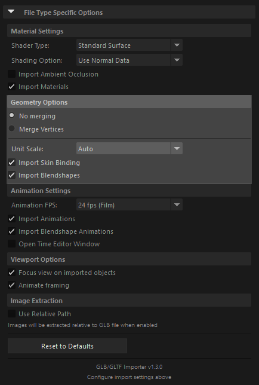

# Geometry Options

Controls how geometry vertices are processed during import:

**No merging** (Default)

- Components remain detached along UV seams

**Merge Vertices**

- Uses an algorithm to merge vertices automatically
- Combines vertices that share the same position
- Suitable for most static geometry imports

**Unit Scale**

- Dropdown option to choose the scale factor for imported geometry
- Available options: **Auto**, **1.0**, **100.0**
- **Auto** (default): Automatically determines the appropriate scale based on the file
- **1.0**: Applies a unit scale of 1.0, useful for scaling down assets from sources like Sketchfab that may have larger asset scales
- **100.0**: Applies a unit scale of 100.0 for scaling up geometry
- Use **1.0** when importing assets that appear too large in the scene, particularly for assets from platforms like Sketchfab

**Import Skin Binding**

- When enabled (default), skin binding data is imported and applied to meshes that include skeleton/deformation data in the GLTF/GLB file
- Required for animated, skinned, or deformable meshes to behave correctly in Maya
- Disable if you only need static geometry without any skeleton-driven deformation, which can reduce scene complexity
- Inverse bind matrices are handled automatically during import (no separate toggle required)

**Import Blendshapes**

- When enabled (default), imports blendshape targets contained in the GLTF/GLB file
- Needed for facial rigs or any deformation driven by blendshape weights
- Disable if you only require static meshes or want to minimize scene data
