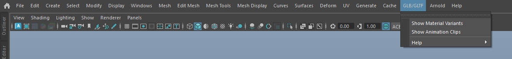

# glTF2.0 Menu

The glTF2.0 menu provides access to various features and tools for working with GLB and GLTF files in Maya.

##Material and Animation Tools
1. Opens both **Material Variants Selector** and **Animation Clips Manager** simultaneously
2. Displays material variants for imported GLB/GLTF assets
3. Shows animation clips from the GLB/GLTF file
4. Both UIs are docked by default when executed

### Material & Animation Tools Options

Access this dialog by clicking the option box (⬜) next to **Material Animation Tools** in the glTF2.0 menu.

**Dock UI by default**

- When enabled (default), the Material Variants Selector and Animation Clips Manager UIs will be automatically docked to the Maya interface when opened
- When disabled, the UIs will appear as floating windows
- This setting persists across Maya sessions
- Useful for customizing your workspace layout preferences

## Help
Provides access to the online documentation.

## About
Shows information about the GLB/GLTF importer plugin 