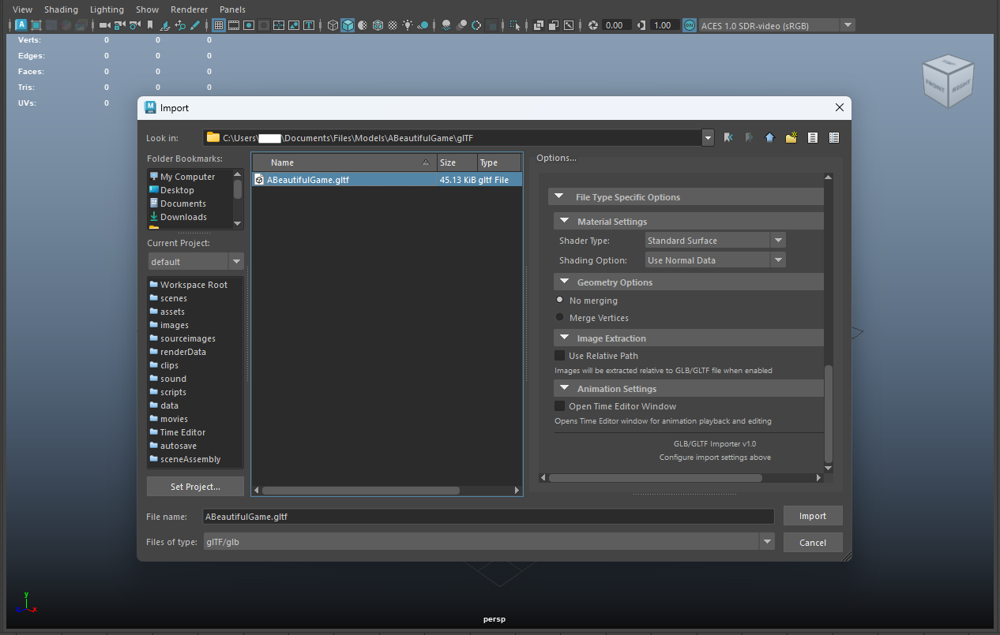

# glTF and glb Importer for Maya

Explore the **glTF and glb Importer for Maya** user guide.

Easily bring .gltf and .glb assets into Maya, enabling you to work with modern 3D formats while preserving materials, animations, scene structure, and more all within Maya’s robust environment.

---

## Key Features

- **File Format Support**: Import both `.gltf` and `.glb` file formats
- **Asset Import**: Support for meshes, materials, textures, animations, and more
- **Material System**: PBR material conversion to Maya's native material system  
- **Animation Support**: Import skeletal animations and morph targets
- **Extension Compatibility**: Support for common Khronos extensions and selected vendor extensions
- **Drag and Drop Support**: Simply drag and drop files into the Maya viewport to import them.

---

## Quick Start Guide

1. **[Install Dependencies](dependencies_installation.md)** - Set up required Python packages
2. **[Install Plugin](plugin_installation.md)** - Copy the plugin files into your Maya documents plug-ins folder
3. **[Import Files](importing_gltf_glb_file.md)** - Start importing glTF/glb content
4. **[Configure Options](file_type_specific_options.md)** - Customize import settings

---

## Trademarks

- **Maya** is a registered trademark of Autodesk, Inc.
- **glTF** is a trademark of The Khronos Group Inc.
- **Python** is a trademark of the Python Software Foundation.
- All other trademarks are the property of their respective owners.

This plugin is an independent third-party tool and is not officially endorsed by or affiliated with Autodesk, Inc. or The Khronos Group Inc.

