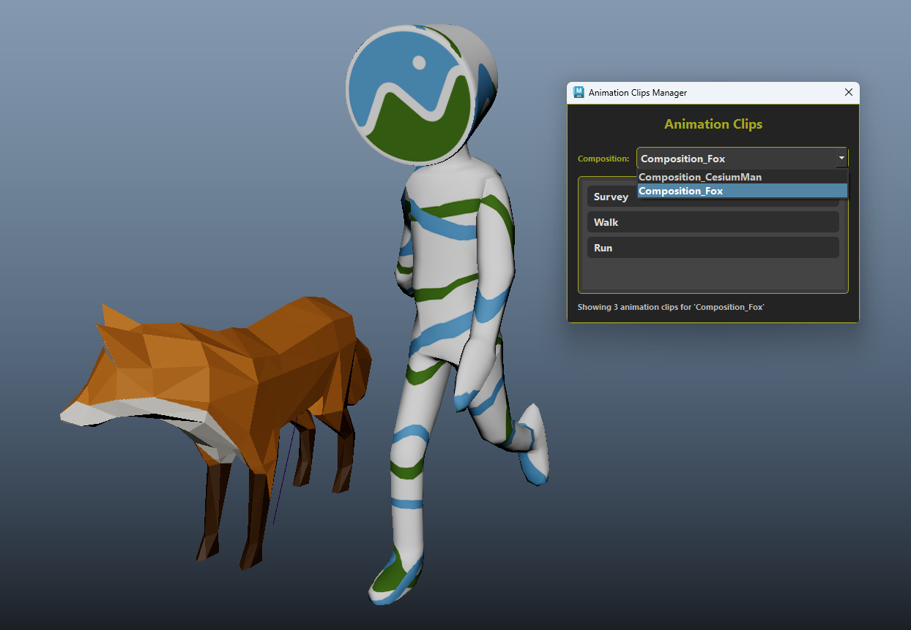

# Show Animation Clips

The Animation Clips Manager allows you to view and manage animation clips associated with imported GLTF/GLB files. This interface provides an organized way to access different animations contained within your 3D assets.

*Courtesy by Khronos glTF sample assets*

## Integration with Maya's Time Editor

The plugin leverages Maya's powerful Time Editor to organize and display all compositions and their corresponding animation clips as individual tracks. When you import a GLTF/GLB file, the plugin automatically creates a structured timeline where:

- Each **composition** appears as a main grouping in the Time Editor
- Each **animation clip** within a composition is represented as a separate track
- The tracks are clearly labeled with their respective animation names
- You can easily navigate between different compositions using the dropdown selector

This integration provides a familiar and powerful interface for managing complex animation sequences, allowing you to work with imported animations using Maya's native timeline tools.

## Using the Animation Clips Manager

When you open the Animation Clips Manager, you'll see:

1. **Composition Dropdown**: At the top, select the composition you want to work with from the dropdown menu. Each imported GLTF/GLB file may contain multiple compositions.

2. **Animation Clips List**: Below the composition selector, you'll see a list of all available animation clips for the selected composition. Each clip represents a different animation sequence (such as character movements, object animations, etc.).

3. **Clip Information**: At the bottom, the manager displays how many animation clips are available for the currently selected composition.

## Features

- **Maya Time Editor Integration**: All compositions and clips are automatically organized as tracks in Maya's Time Editor
- **Multiple Compositions**: Switch between different compositions using the dropdown to access their respective animation clips
- **Clip Organization**: All animation clips are clearly listed and organized by composition
- **Native Maya Workflow**: Work with imported animations using Maya's familiar timeline interface
- **Easy Access**: Quickly browse through available animations without needing to manually search through the scene

All animation clips are extracted as defined in the GLTF/GLB file, maintaining the original structure and organization of the animations.