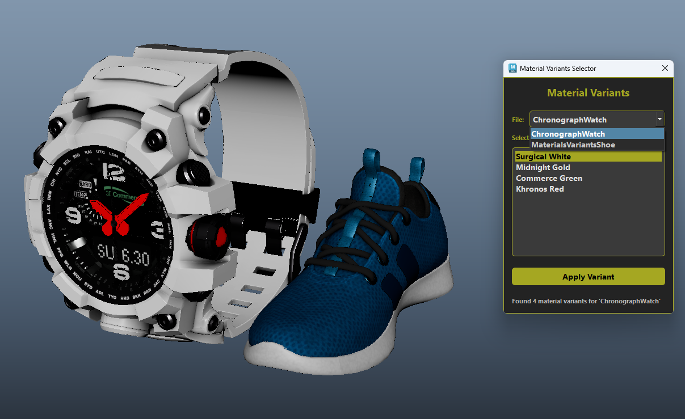

# Show Material Variants

The Material Variants Selector allows you to browse and apply different material configurations available in your GLTF/GLB files. This feature is particularly useful when working with assets that contain multiple material variations for the same model.

*Courtesy by Khronos glTF sample assets*

## How to Use Material Variants

1. **File Selection**: Choose the target file from the dropdown menu at the top of the dialog
2. **Variant Selection**: Browse through the available material variants listed for the selected file
3. **Apply Changes**: Click the "Apply Variant" button to apply the selected material variant to your model

## Features

- **Multi-file Support**: Switch between different files that contain material variants
- **Variant Preview**: See all available material variants for each file in an organized list
- **Easy Application**: Apply material variants with a single click
- **Variant Counter**: View the total number of available variants for each file

Material variants enable artists and designers to quickly experiment with different looks and styles for their 3D assets without needing to manage separate files for each variation.

## Important Note

**Warning**: Avoid using "Delete Unused Nodes" from the Hypershade's Edit dropdown menu when working with material variants. This operation will delete materials that are not currently assigned to geometry, which includes the alternative materials used by other variants. If unused materials are deleted, switching between material variants will not work properly as the required materials will no longer be available in the scene.