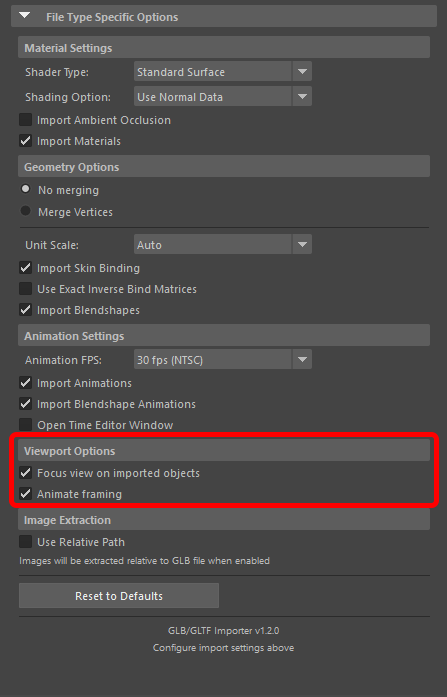

# Viewport Options

When importing GLTF/GLB files, you can configure viewport options to control how the camera behaves after import.

## Focus view on imported objects

- When enabled (default), automatically focuses the viewport camera on imported objects after import
- Ensures that imported geometry is immediately visible and properly framed in the viewport
- Useful when importing objects into an empty scene or when you want to quickly inspect the imported model
- Disable if you want to maintain the current camera position and framing

## Animate framing

- When enabled (default), animates the camera framing to smoothly transition and focus on imported objects
- Provides a smooth camera movement to frame the imported objects rather than an instant jump
- Creates a more polished viewing experience when objects are imported
- Disable if you prefer an instant camera focus without animation

---

## Troubleshooting Viewport Display Issues

### Objects Disappear in Shaded Display Mode

If imported meshes or geometries disappear when you enable shaded display with texture maps (pressing **6**), try these solutions:

**Backface Culling**
- Change the **Backface Culling** setting to **"off"** in the mesh's shape node under the **Mesh Component Display** section
- This allows you to see both sides of the geometry

**Opacity Connection**
- The shader's **Opacity** attribute may be connected, causing transparency issues
- Temporarily disconnect the opacity connection in the shader's attribute editor to see the geometry

**Viewport Renderer**
- Start **Arnold** in the viewport to see the render result, which may display the geometry correctly
- Maya's default viewport renderer may not display all material properties correctly

